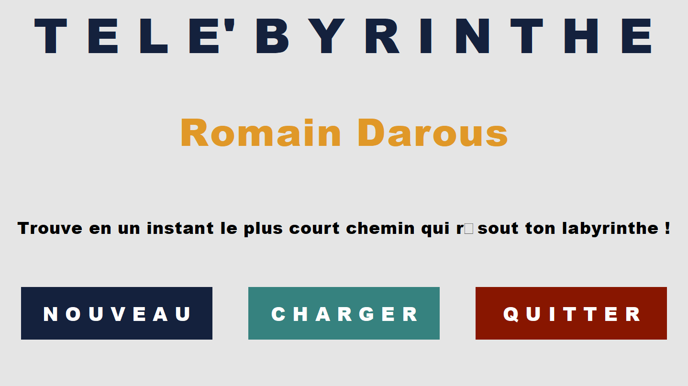
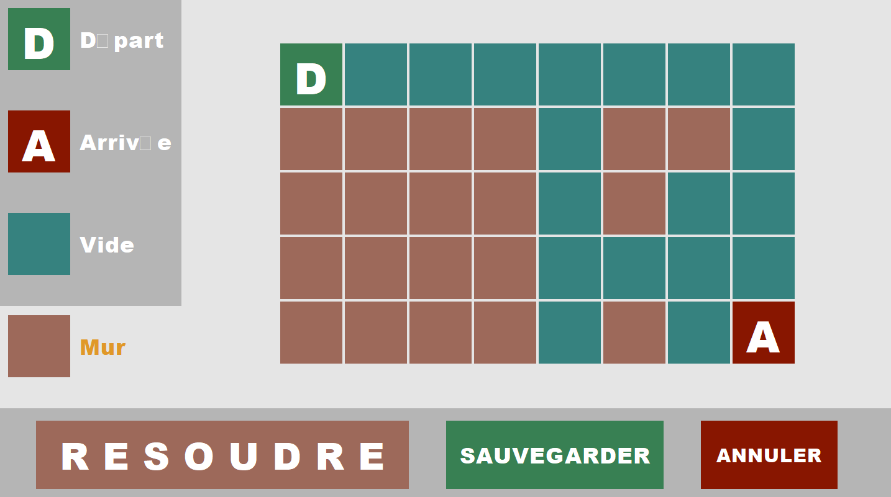
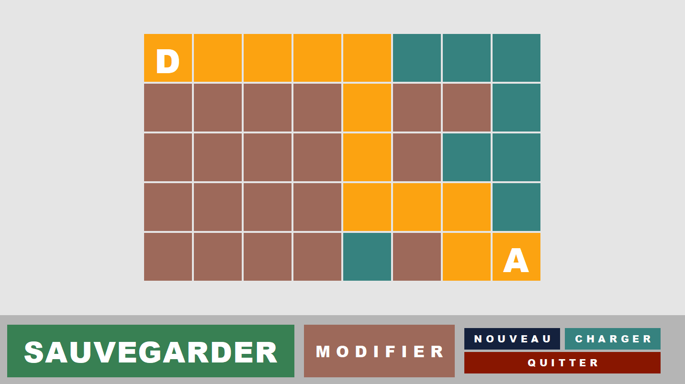

# INF103: Maze Project
Romain Darous.

### INF103
INF103 is the Java course at Telecom Paris. This repository corresponds to the final project of the course.

### Goal of the project
The project involved coding an interface that allows for the creation and solving of mazes by finding the shortest path. More detailed objectives are listed below:
- Create a graphical interface that enables loading a maze from a text file, modifying it, and saving it.
- Implement Dijkstra's algorithm to find the shortest path from the starting point to the destination in the maze.
- Implement an MVC (Model-View-Controller) structure.

### How to run the project
To run the project, download the two folders `data` and `src` and place them in a directory named `MazeProject`. Then, load the folder as the Java workspace in your development environment (such as Eclipse or VS Code).

Next, navigate to the file `Main.java`, located at `src/ui/Main.java`, and run it.

### Example of pages
Here is the home page of the application :

Then, you can create or load a maze and build your own maze. Here is an exmaple of maze :

Finally, you can solve the maze and get the shortest path :

